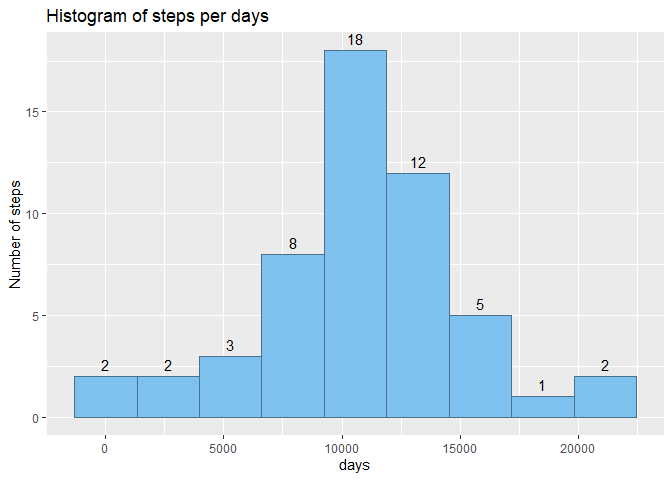

## Loading and preprocessing the data

```r
# Loading and preprocessing the data
data.initial <- read.csv(unz("activity.zip", "activity.csv"), sep=",")
data.initial$date <- as.Date(data.initial$date)
```

## What is mean total number of steps taken per day?
<!-- -->

Mean of the total number of steps per day: **10766.2**   
Median of the total number of steps per day: **10765**

## What is the average daily activity pattern?
<!-- -->

Which 5-minute interval, on average across all the days in the dataset, contains the maximum number of steps? Interval **835**


## Imputing missing values

<!-- -->

The total number of missing values in the dataset is **2304**

For filling in all of the missing values in the dataset, the mean for that 5-minute interval across all days was used.

Mean of the total number of steps per day (NA filled): **10766.2**   
Median of the total number of steps per day (NA filled): **10766.2**

The impact of imputing the missing data on the estimates of the total daily number of steps is 
**0** , on the mean and **1.2** on the median.

## Are there differences in activity patterns between weekdays and weekends?
<!-- -->
